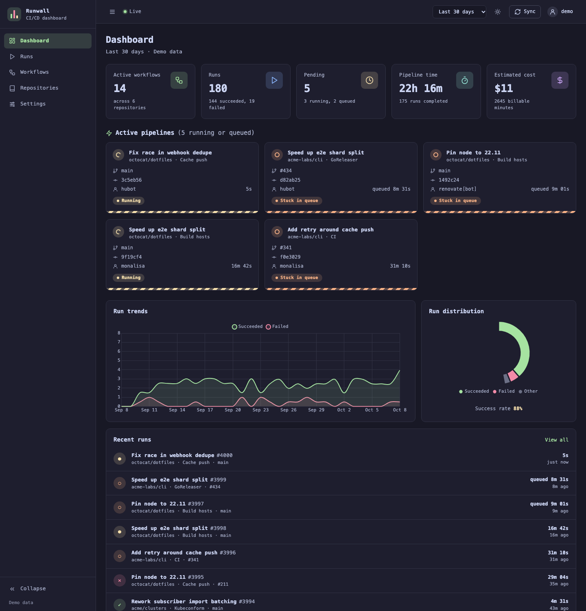
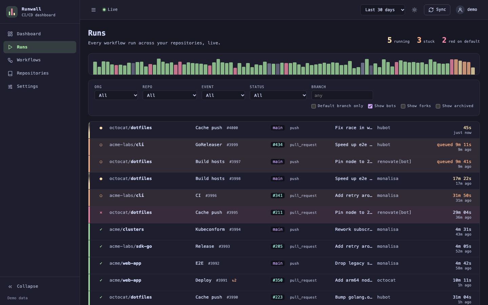
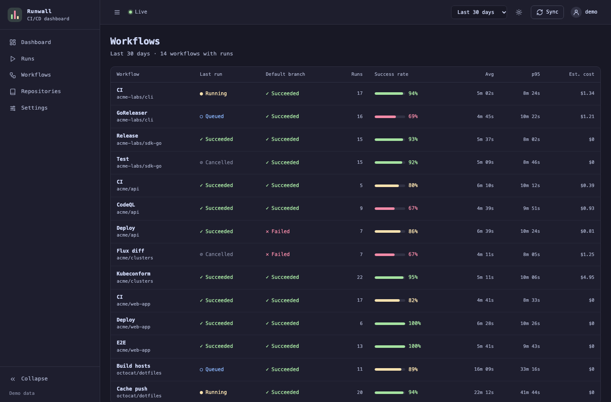
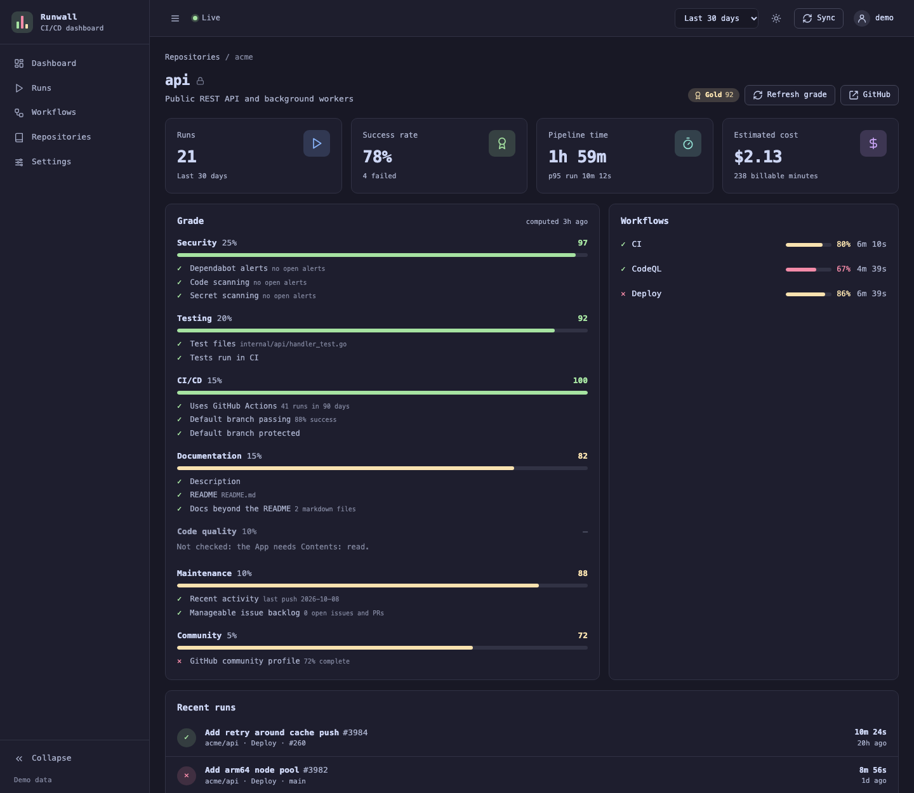

# Runwall

Runwall shows the GitHub Actions runs of all the repositories in your organizations on one live page. It shows which runs operate now, which runs wait too long, and which workflows fail on the default branch. It also shows the duration and the cost of your runs.



Runwall is one Go binary. It keeps its data in an SQLite file. GitHub sends webhooks to Runwall, and the page changes in approximately one second. A reconciler gets the changes that the webhooks did not send. Each person signs in with GitHub. Each person sees only the repositories that they can access on GitHub.

## Features

- **Live run list.** The list shows the runs of all organizations. You can filter the list by organization, repository, branch, event and status. The filters are in the URL, thus you can share a filtered view. A strip of bars shows the recent runs. The height of a bar shows the duration of the run.
- **Run details.** For each job, Runwall shows the steps while the job operates. When the job is complete, Runwall shows the log and goes to the first error. Runwall also shows the check annotations and the workflow file.
- **Re-run and cancel.** You can re-run the failed jobs, all the jobs or one job. You can also cancel a run. Runwall sends these requests with your GitHub token. Thus, GitHub does a check of your write access. Runwall records each request in an audit log.
- **Dashboard.** The dashboard shows the active pipelines, the trend of successful and failed runs, the distribution of results, the total duration and the estimated cost. Select a period of 24 hours, 7 days, 30 days or 90 days.
- **Workflows.** For each workflow, Runwall shows the success rate, the average duration, the p95 duration and the cost.
- **Repositories.** Runwall gives each repository a grade: gold, silver or bronze. The grade comes from security alerts, tests, CI health, documentation, code quality, maintenance and community files.
- **Stuck runs.** Runwall shows a run as stuck when it waits in the queue for longer than a set time.
- **Kiosk links.** A kiosk link shows a read-only dashboard on a wall display. It does not need a sign-in.
- **MCP endpoint.** AI agents (for example, Claude Code and Cursor) can read runs, failures, logs, statistics and grades. They use a personal token.
- **Themes.** Runwall has a light theme and a dark theme (Catppuccin). You can use it on a mobile phone.

<table>
  <tr>
    <td></td>
    <td></td>
  </tr>
  <tr>
    <td colspan="2"></td>
  </tr>
</table>

## Try Runwall

The demo mode shows sample data. It does not connect to GitHub.

1. Start Runwall in demo mode:

   ```sh
   docker run --rm -p 8080:8080 ghcr.io/nklmilojevic/runwall --demo
   ```

   From a checkout, you can also use this command:

   ```sh
   go run ./cmd/runwall --demo
   ```

2. Open http://localhost:8080.

## Setup

### 1. Make a GitHub App

1. Find the address that people will use for Runwall (for example, `runwall.example.com`).
2. In the link below, replace `HOST` with this address.

   ```
   https://github.com/settings/apps/new?name=Runwall&url=https://HOST&public=false&webhook_active=true&webhook_url=https://HOST/webhook&callback_urls[]=https://HOST/auth/callback&actions=write&administration=read&checks=read&contents=read&metadata=read&vulnerability_alerts=read&security_events=read&secret_scanning_alerts=read&events[]=workflow_run&events[]=workflow_job&events[]=repository
   ```

   To make the App for an organization, start the link with `https://github.com/organizations/ORG/settings/apps/new?`. Keep the same parameters.

3. Open the link.
4. Make a webhook secret with `openssl rand -hex 32`.
5. Type the webhook secret in the form.
6. Create the App.
7. Write down the App ID and the Client ID.
8. Generate a client secret.
9. Generate a private key.
10. Install the App on each account that has runs that you want to see.

**Public App or private App.** You can install a private App only on the account that owns it. Only the members of that account can sign in. To show runs from more than one organization, make the App public. Then set `ALLOWED_ACCOUNTS`. Runwall ignores the installations on all other accounts.

**The permissions of the App:**

| Permission                                                            | Runwall uses it for                                                                                                                      |
| --------------------------------------------------------------------- | ---------------------------------------------------------------------------------------------------------------------------------------- |
| Actions: read and write                                               | Runs, jobs and logs. Runwall uses write access only with the token of the person who signs in. It uses this access to re-run and cancel. |
| Checks: read                                                          | Annotations                                                                                                                              |
| Contents: read                                                        | The workflow file, and the checks for tests, documentation and linters in the grades                                                     |
| Administration: read                                                  | Branch protection in the grades                                                                                                          |
| Dependabot alerts, Code scanning alerts, Secret scanning alerts: read | The security part of the grades                                                                                                          |
| Metadata: read                                                        | The list of repositories                                                                                                                 |

Only Actions and Metadata are necessary. If the App does not have one of the other permissions, the related feature shows "not checked". The feature does not fail.

### 2. Start Runwall

Runwall reads its secrets from environment variables:

| Variable                                   | Value                                                                                                                       |
| ------------------------------------------ | --------------------------------------------------------------------------------------------------------------------------- |
| `GITHUB_APP_ID`                            | The App ID                                                                                                                  |
| `GITHUB_APP_PRIVATE_KEY_FILE`              | The path to the private key file of the App (`.pem`). You can also put the contents of the key in `GITHUB_APP_PRIVATE_KEY`. |
| `GITHUB_WEBHOOK_SECRET`                    | The webhook secret                                                                                                          |
| `GITHUB_CLIENT_ID`, `GITHUB_CLIENT_SECRET` | The Client ID and the client secret. Runwall uses them for the GitHub sign-in.                                              |
| `SESSION_KEY`                              | A random key. Make it with `openssl rand -hex 32`. Runwall uses it to encrypt the sessions and the tokens.                  |
| `BASE_URL`                                 | `https://HOST`. It must agree with the callback URL of the App.                                                             |

Copy [`env.example`](env.example) to `.env` and fill in the values. Do not commit `.env`. In production, keep the secrets in a secret manager and give them to Runwall as environment variables when it starts.

Select one of these methods to start Runwall:

- **Docker Compose.** Use [`deploy/docker-compose.yml`](deploy/docker-compose.yml). It starts Runwall with a persistent volume. It can also start a Cloudflare Tunnel.
- **Kubernetes.** Use the Kustomize base in [`deploy/k8s`](deploy/k8s). It has a Deployment with one replica, a PersistentVolumeClaim, a Service, an ExternalSecret for the secrets and a ConfigMap for the settings.
- **Binary.** Build the binary with `go build ./cmd/runwall`. Or use `just run`. This command reads the settings from `.env`.

Use only one replica. Runwall keeps its data in an SQLite file.

### 3. Make the webhook available

GitHub must have access to `https://HOST/webhook`. The other pages can stay private.

If you use Cloudflare, do these steps:

1. Put the Runwall pages behind Cloudflare Access.
2. Set a bypass in Cloudflare Access for the `/webhook` path.

Runwall does a check of the GitHub signature on each webhook delivery.

To run Runwall on a laptop, use the tunnel in [`deploy/cloudflared/config.example.yml`](deploy/cloudflared/config.example.yml). This tunnel makes only the webhook path available.

When Runwall stops, GitHub cannot send webhooks to it. GitHub does not send them again. When Runwall starts again, the reconciler gets the missing changes in one or two minutes.

### 4. Use Runwall

- **Sign-in.** People sign in with GitHub. If you set `ALLOWED_USERS`, only these people can sign in. If you do not set it, each person with access to one or more repositories in an allowed installation can sign in.
- **Administrators.** Set the administrators in `ADMIN_USERS`. If you do not set it, the owner of the App is the administrator. Administrators make kiosk links. They also see the audit log of re-runs and cancellations on the Settings page.
- **MCP.** To connect an AI agent, do these steps:
  1. Open the Settings page.
  2. Create a personal token.
  3. Copy the command that the page shows. For Claude Code, the command is similar to this example:

     ```sh
     claude mcp add --transport http runwall https://HOST/mcp --header "Authorization: Bearer <token>"
     ```

  The MCP tools can only read data. The tools are `list_runs`, `get_run`, `get_job_log`, `failing_workflows`, `workflow_stats` and `repo_score`.

## Configuration

| Variable                           | Default                                        | Description                                                                                                                              |
| ---------------------------------- | ---------------------------------------------- | ---------------------------------------------------------------------------------------------------------------------------------------- |
| `BASE_URL`                         | `http://` + `LISTEN_ADDR`                      | The public URL. Runwall uses it for the GitHub callback, the kiosk links and the MCP link.                                               |
| `LISTEN_ADDR`                      | `127.0.0.1:8080` (`:8080` in the image)        | The address where Runwall listens.                                                                                                       |
| `DB_PATH`                          | `runwall.db` (`/data/runwall.db` in the image) | The SQLite file.                                                                                                                         |
| `ALLOWED_ACCOUNTS`                 | All accounts                                   | The installation accounts that Runwall uses, separated by commas. Runwall ignores all other accounts.                                    |
| `ALLOWED_USERS`                    | Each person with repository access             | The GitHub logins that can sign in, separated by commas.                                                                                 |
| `ADMIN_USERS`                      | The owner of the App                           | The GitHub logins of the administrators, separated by commas.                                                                            |
| `STUCK_THRESHOLD`                  | `5m`                                           | A run that waits in the queue for longer than this time is stuck.                                                                        |
| `BACKFILL_WINDOW`                  | `168h`                                         | The history that Runwall reads for a new repository.                                                                                     |
| `RECONCILE_INTERVAL`               | `3m`                                           | The interval between checks of busy repositories.                                                                                        |
| `COLD_INTERVAL`                    | `1h`                                           | The interval between checks of quiet repositories. A repository is quiet when it has no push and no run for 24 hours.                    |
| `SYNC_CONCURRENCY`                 | `4`                                            | The number of repositories that Runwall checks at the same time.                                                                         |
| `JOB_BACKFILL`                     | `200`                                          | For each installation and check, the number of older runs for which Runwall reads the jobs. Runwall uses the jobs to calculate the cost. |
| `RETENTION`                        | `2160h` (90 days)                              | The time that Runwall keeps completed runs.                                                                                              |
| `COST_RATES_FILE`                  | Built-in prices                                | A JSON file that changes the price per minute. Example: `{"as_of": "…", "rates": {"linux-2": 0.006}, "labels": {"my-runner": 0.02}}`     |
| `NOTIFIER`                         | `macos` on macOS, `log` on other systems       | The notification for failed runs on the default branch: `macos`, `log` or `none`.                                                        |
| `GITHUB_API_URL`, `GITHUB_WEB_URL` | github.com                                     | Set these for GitHub Enterprise Server.                                                                                                  |
| `LOG_LEVEL`                        | `info`                                         | The log level.                                                                                                                           |

## How Runwall works

- **Webhooks.** Runwall receives the `workflow_run`, `workflow_job` and `repository` webhooks. It does a check of each signature. It ignores a delivery that it received before. An older event does not replace newer data.
- **Reconciler.** The reconciler reads the newest runs of each repository with conditional requests. If a repository has no changes, GitHub sends `304 Not Modified`. GitHub does not count this response in the rate limit. The reconciler checks busy repositories at each interval and quiet repositories one time each hour.
- **Rate limit.** The reconciler monitors the rate limit of each installation. When less than 20% of the limit is available, Runwall stops the cost backfill and the grades. When less than 3% is available, Runwall waits until the limit resets. The bottom of each page shows the available limit.
- **Live updates.** Runwall sends updates to the browser with server-sent events. Each person gets only the updates for the repositories that they can see.
- **Logs.** Runwall reads the logs from GitHub when you open them. GitHub makes a log available only when the job is complete. While a job operates, Runwall shows the steps and a link to the live log on GitHub.
- **Costs.** The costs are estimates from the GitHub list prices. Runwall rounds the duration of each job up to the next minute. Then it multiplies the minutes by the price for the runner type. Standard runners on public repositories and self-hosted runners are free. Runwall does not subtract the minutes that your plan includes.

## Development

The Nix flake has all the development tools: Go, gopls, golangci-lint, just, lefthook, oxfmt, zizmor, SQLite, the GitHub CLI, the 1Password CLI, cloudflared, kubectl and kustomize.

1. Start the development shell:

   ```sh
   nix develop
   ```

   If you use direnv, run `direnv allow` one time. Then the shell starts automatically in this directory.

   The shell installs the git hooks from `.lefthook.toml`. Before each commit, the hooks format Go, templ, justfile, YAML, Markdown, JSON, CSS and JavaScript files, and zizmor examines the workflows. Before each push, the hooks run `just check` and `just lint`.

2. Run `just` to see all the recipes. These are the most important recipes:

   ```sh
   just test     # Run the tests with the race detector.
   just lint     # Run golangci-lint.
   just check    # Run the same checks as CI.
   just demo     # Start with sample data on http://127.0.0.1:8080.
   just run      # Start with a real GitHub App. The settings come from .env.
   just tunnel   # Start a cloudflared tunnel for /webhook only.
   ```

Runwall uses Go, [templ](https://templ.guide), [htmx](https://htmx.org) with server-sent events, [Chart.js](https://www.chartjs.org) and SQLite ([modernc.org/sqlite](https://modernc.org/sqlite), without CGO). The repository contains the generated `*_templ.go` files. After you change a `.templ` file, run `go tool templ generate`.

## License

[AGPL-3.0](LICENSE)
